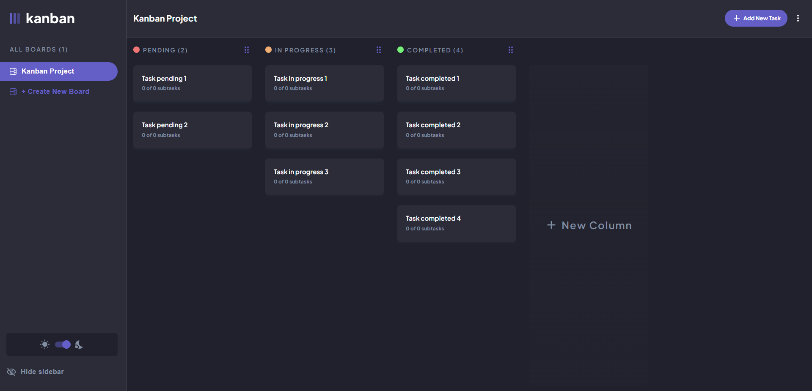
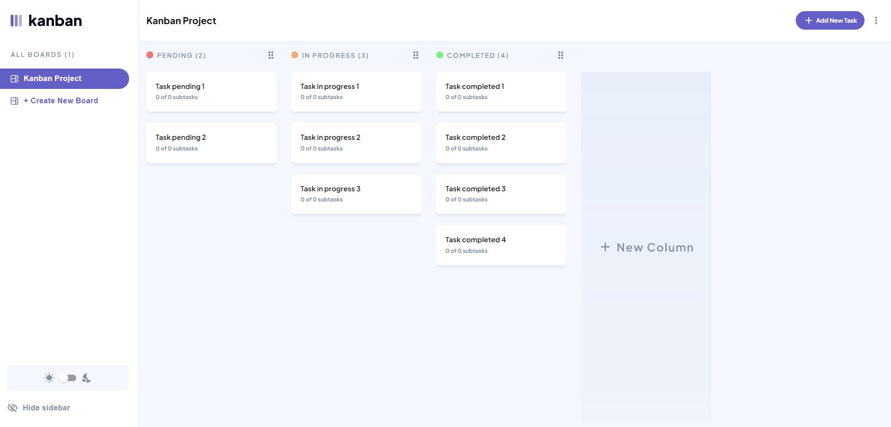
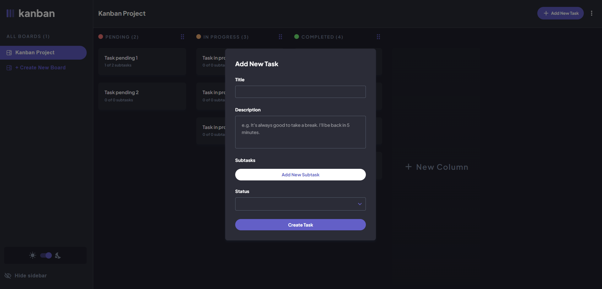
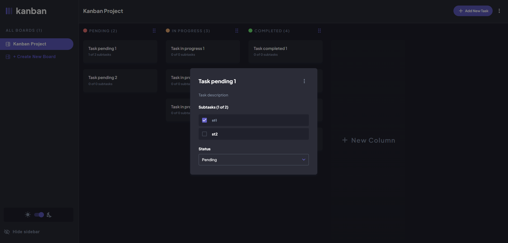
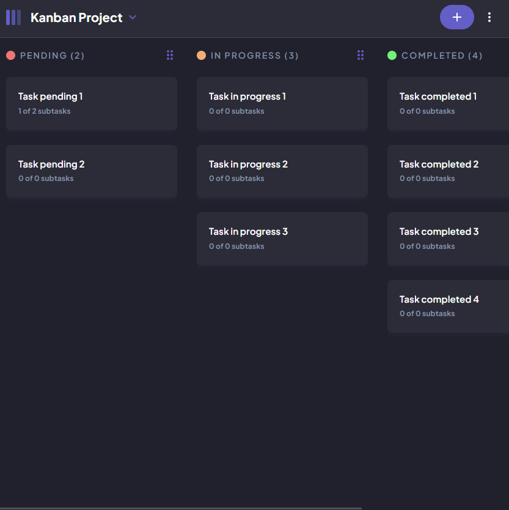
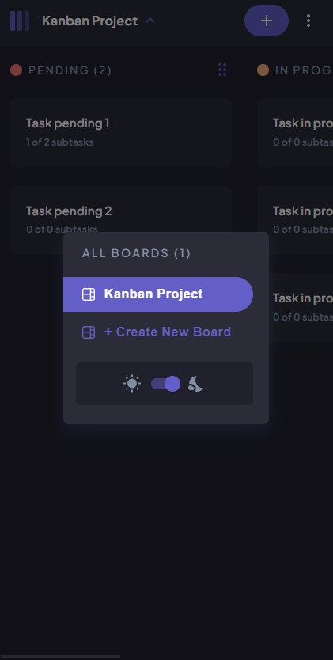

# Frontend Mentor - Kanban task management web app solution

This is a solution to the [Kanban task management web app challenge on Frontend Mentor](https://www.frontendmentor.io/challenges/kanban-task-management-web-app-wgQLt-HlbB).

## [Demo Here](https://kanban-fr.vercel.app/)

### The challenge

Users should be able to:

- View the optimal layout for the app depending on their device's screen size
- See hover states for all interactive elements on the page
- Create, read, update, and delete boards and tasks
- Receive form validations when trying to create/edit boards and tasks
- Mark subtasks as complete and move tasks between columns
- Hide/show the board sidebar
- Toggle the theme between light/dark modes
- Allow users to drag and drop tasks to change their status and re-order them in a column
-  Keep track of any changes, even after refreshing the browser

### Screenshot

### Links

- Solution URL: [Add solution URL here](https://your-solution-url.com)
- Live Site URL: [Add live site URL here](https://your-live-site-url.com)

### Built with

- [React](https://reactjs.org/) - JS library
- [Material UI](https://material-ui.com/) - For UI components
- [Redux-toolkit](https://redux-toolkit.js.org/) - For state management
- [React-hook-form](https://react-hook-form.com/) - For form validation
- Dark mode
- Mobile-first workflow
- react-beautiful-dnd - For drag and drop

## Author

- LinkedIn - [Jose Angarita](https://www.linkedin.com/in/jose-angarita-40709a1b1/)
- Frontend Mentor - [@jocanm](https://www.frontendmentor.io/profile/Jocanm)